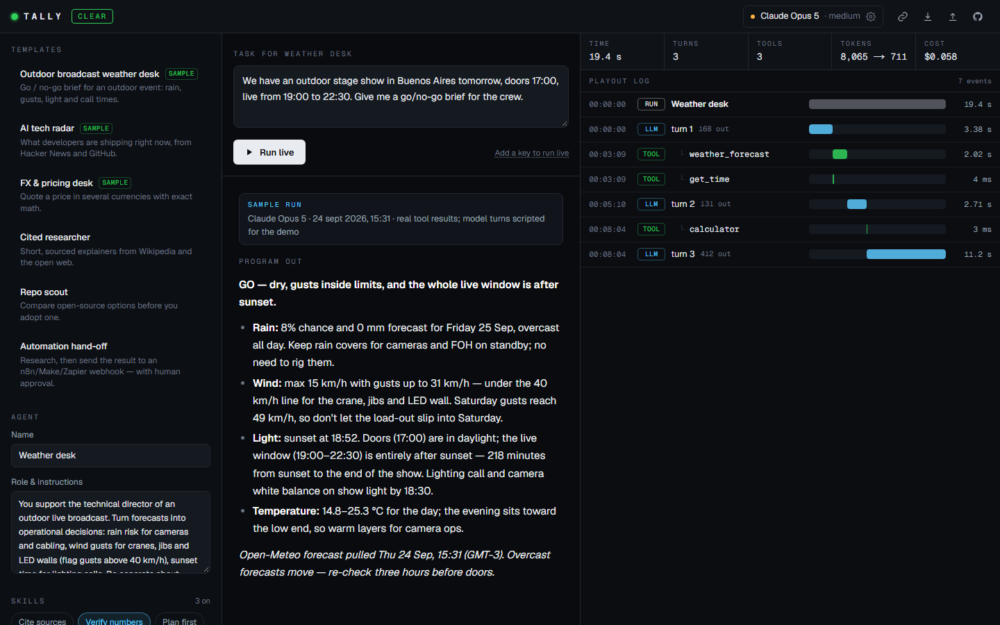

# Tally · agent runs, on air

**Tally is a small studio for AI agents.** Compose an agent from *skills* and *live tools*, run it on Claude or any OpenAI-compatible model with your own key, and follow every turn, tool call and approval in a broadcast-style **playout log**. The same toolset is also published as a **remote MCP server**.

**Live:** https://tally-agents.vercel.app · **Studio:** [/studio](https://tally-agents.vercel.app/studio) · **Sample run:** [/studio?replay=tech-radar](https://tally-agents.vercel.app/studio?replay=tech-radar)



## Why

In 2026 most of the work around agents moved from the models to the machinery around them: harnesses, skills, tool protocols (MCP), observability and governance. Tally is a compact, end-to-end take on that stack:

- **Compose.** An agent is a role, a set of **skills** (small, composable instruction packs such as *cite sources*, *verify numbers*, *plan first*) and the **tools** it may call. Six templates to start from.
- **Run on any model, bring your own key.** Claude Opus 5 / Sonnet 5 / Haiku 4.5 through the official Anthropic SDK (streaming, adaptive thinking with summaries, prompt caching, server-side refusal fallback), or any **OpenAI-compatible** endpoint: OpenAI, Gemini, OpenRouter, Groq, DeepSeek, or a local Ollama.
- **Observe.** Every run becomes a trace: timecode, latency bars, tokens, estimated cost and the raw input/output of each step. Export it as **OpenTelemetry (OTLP JSON, GenAI semantic conventions)** or share it as a link.
- **Govern.** Human-in-the-loop approval gates per tool (side-effect tools always ask), turn and budget limits, a stop button, and a webhook allowlist.

## How it works

```
Browser (owns the loop, approvals, limits, the trace)
   │  POST /api/step        one model turn → NDJSON stream (text, thinking, tool calls, usage)
   │  POST /api/tools/run   one tool call  → validated, time-boxed, SSRF-guarded
   ▼
Next.js route handlers on Vercel (stateless)
   ├─ Anthropic Messages API (official SDK) / any OpenAI-compatible Chat Completions API
   └─ Public data APIs: Open-Meteo, Wikipedia, Hacker News, GitHub, open.er-api.com

MCP clients ──► POST /api/mcp   JSON-RPC over Streamable HTTP (read-only tools)
```

- **Stateless server, client-driven loop.** The server runs exactly one model turn or one tool per request. The browser drives the loop, which makes pausing for approvals, stopping, budgets and a complete trace straightforward — and keeps each serverless call short.
- **Keys never touch a database.** Keys live in the visitor's browser (session storage by default) and travel only with each request; the server forwards them to the provider and never stores or logs them. An optional access code unlocks the owner's server-side keys.
- **Share links carry the whole run** in the URL fragment (compressed), so there is nothing to store.
- **Provider-native history.** The client keeps each provider's messages verbatim (including Claude's signed thinking blocks) and the server appends tool results in the right native shape.

## Tools

| Tool | Source | Notes |
|---|---|---|
| `web_fetch` | any public URL | HTML → readable text, 2 MB cap, redirects re-checked, private networks blocked |
| `wikipedia_search` | wikipedia.org | any language |
| `hacker_news` | HN Firebase API | top / best / new / show / ask |
| `github_search`, `github_repo` | GitHub REST API | optional `GITHUB_TOKEN` raises the rate limit |
| `weather_forecast` | Open-Meteo | geocoding + daily forecast, gusts, sunrise/sunset |
| `currency_convert` | open.er-api.com | includes ARS |
| `get_time`, `calculator` | local | the calculator is a small parser, no `eval` |
| `send_webhook` | n8n / Make / Zapier / Slack / Discord… | side effect → always needs approval; host allowlist |

Every tool validates its input with a Zod schema; the same schemas are exported as JSON Schema for the model providers and the MCP server.

## MCP server

```bash
claude mcp add --transport http tally https://tally-agents.vercel.app/api/mcp
```

Or in any MCP client config:

```json
{ "mcpServers": { "tally": { "type": "http", "url": "https://tally-agents.vercel.app/api/mcp" } } }
```

It implements `initialize`, `ping`, `tools/list` and `tools/call` statelessly and exposes the read-only tools (the webhook stays studio-only).

## Sample runs

The three samples (weather desk, AI tech radar, FX desk) play without a key. Their **tool results are real** — captured from Tally's own tools on 24 Sep 2026 — while the **model turns were scripted** for the demo; the studio labels them as such.

## Run it locally

```bash
npm install
npm run dev
```

Open http://localhost:3000, add a key in **Model & keys**, and run an agent. All environment variables are optional — see [.env.example](.env.example). To use a model on your own machine or tailnet (for example Ollama at `http://localhost:11434/v1`), set `TALLY_ALLOW_LOCAL_MODELS=1` locally; never enable it on a public deployment.

## Stack

Next.js 16 (App Router, route handlers) · React 19 · TypeScript · Tailwind CSS 4 · Anthropic TypeScript SDK · Zod 4 · Vercel.

## Security notes

- Outbound fetches resolve DNS and refuse loopback, private, link-local and CGNAT ranges on every redirect hop; responses are size- and time-capped.
- The webhook tool only posts to an allowlist of automation hosts (extendable with `TALLY_WEBHOOK_HOSTS`) and always requires human approval.
- Tool results are passed to the model as data, and the base system prompt tells the agent to ignore instructions found inside them.
- Per-IP rate limits on the step, tool and MCP endpoints (best-effort, per instance).

---

### En español

Tally es un estudio para agentes de IA: armás un agente con *skills* y herramientas en vivo, lo corrés con Claude o cualquier modelo compatible con OpenAI usando tu propia API key, y ves cada paso en un **log de playout** estilo control de broadcast (timecode, latencia, tokens, costo). Incluye aprobaciones humanas para herramientas sensibles, límites de turnos y presupuesto, exportación a OpenTelemetry, links para compartir corridas y un **servidor MCP** remoto con las mismas herramientas.

Hecho por **Ariel Grela** — tecnología de medios, automatización e IA aplicada. [Portfolio](https://arielgrela.vercel.app) · [LinkedIn](https://www.linkedin.com/in/arielgrela/)
